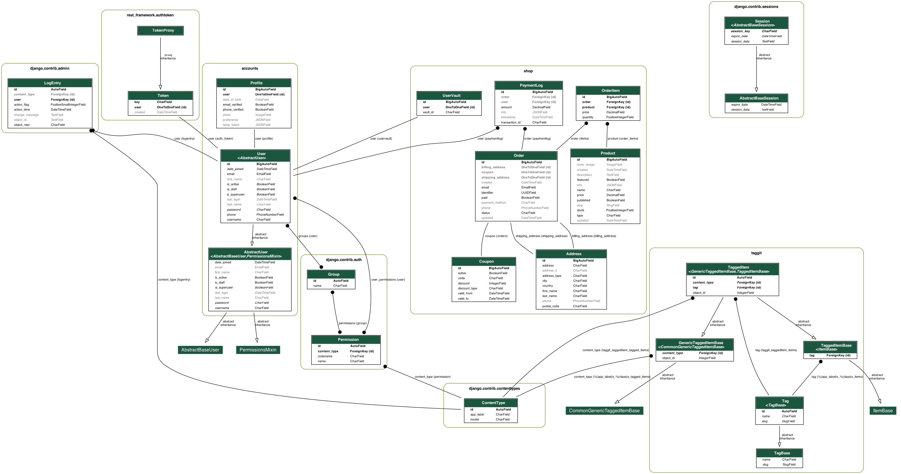

# pizzarree
Pizza App - OPAIC IA512002 Submission 

Author: Ahmed A. <ahbox@outlook.com>
# Demo
- Frontend
  https://shop-demo.amdrs.link

- API
  https://shop-demo-api.amdrs.link

# Description 
Fullstack pizza shop built with
    
    - Technologies Highlights
        - Django Rest framework - Backend
        - VueJs - Frontend
        - Docker & Docker-compose - Devops
        - SQL Compatible DB - Postgres
# Problem Domain
-  As a business I need a way to automate selling my merchandise (Pizza) and automate the stocks and payment collections throughout the ordering to delivery process.  

---
# Solution
  - develop robust backend database models, that leverages 
    - Inheritance
    - Polymorphism
    - Object Oriented
- develop a seamless testable frontend multiplatform application that fits all screens and installs natively on target system.

# How
- Test driven development cycle for the whole stack
```#bash
# frontend run test
npm run test:unit

# backend
python manage.py test 
```
---
# Class Diagram


### Maintainer : Ahmed A. <ahbox@outlook.com>

### Mentor : Dr. Tariq Khan
### Head of Department : Prof. Farhad Mehdipour